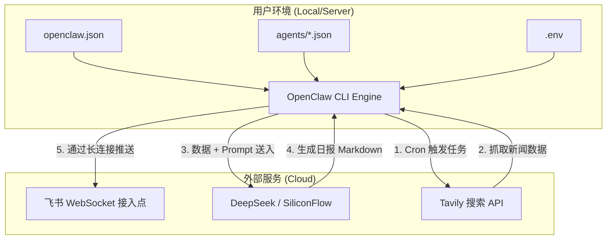

# Tabris OpenClaw - DOTA2 & XG 战报推送助手

本项目基于 [OpenClaw](https://github.com/AlexAnys/openclaw) (原 Clawdbot) 构建，旨在通过飞书机器人自动推送 DOTA2 每日新闻和 XG 战队战报。

## 核心功能

- **DOTA2 每日新闻抓取**：利用 OpenClaw 的搜索能力，自动汇总每日赛事、更新及社区动态。
- **XG 队战报总结**：通过定制化 Prompt 和搜索工具，生成 XG 战队的深度比赛日报。
- **飞书自动推送**：配置 WebSocket 模式，无需公网 IP 即可实现机器人长连接推送。
- **定时任务**：使用 OpenClaw 内置的 Cron 功能，支持 24/7 自动化运行。

## 系统架构与原理

### 架构图 (Architecture)



### 推送原理说明

1.  **低代码配置驱动**：项目本身不编写复杂的 JavaScript/Python 逻辑。所有的核心功能（WebSocket 维护、LLM 接口封装、工具调度）均由 OpenClaw CLI 引擎提供。
2.  **Cron 调度**：引擎会根据 `agents/` 目录下的 JSON 配置文件（如 `dota2-news.json`）中定义的 `cron` 表达式定时触发任务。
3.  **智能体工作流**：
    -   **Search (搜索)**：调用 Tavily API 检索互联网上的实时信息。
    -   **Summarize (总结)**：将搜索结果发送给 LLM（如 DeepSeek-V3），根据定义的 Prompt 生成 Markdown 日报。
    -   **Push (推送)**：通过已经建立好的飞书长连接，直接将消息推送到指定的目标 ID。

## 快速开始

### 1. 环境准备
- **Node.js**: 需要 v22 或更高版本。
- **OpenClaw CLI**: `npm install -g @openclaw/cli`
- **环境变量**: 
  - 复制 `.env.example` 为 `.env` 并填入你的 API Keys。
  - 获取飞书 `AppID`, `AppSecret` 和 `Verification Token`。

### 2. 启动网关
使用 `dotenv` 工具注入环境变量并启动：
```bash
npm install -g dotenv-cli
dotenv -- openclaw gateway start --config ./openclaw.json
```

## 远程服务器部署 (Ubuntu/Linux)

为了实现 24/7 不间断推送，建议将项目部署到 Linux 云服务器（如阿里云、腾讯云、AWS）。

### 1. 自动化部署环境
在服务器上运行以下脚本，自动安装 Node.js v22、pnpm、OpenClaw 和 PM2：
```bash
chmod +x scripts/deploy.sh
./scripts/deploy.sh
```

### 2. 使用 PM2 实现后台持久运行
在服务器上建议使用 PM2 管理进程，确保断线重连和开机自启：
```bash
# 启动网关
dotenv -- pm2 start openclaw --name "openclaw-gateway" -- gateway start --config ./openclaw.json

# 查看运行日志
pm2 logs openclaw-gateway

# 设置开机自启 (根据提示执行输出的命令)
pm2 save
pm2 startup
```

### 3. 服务器防火墙配置
- 确保服务器防火墙（安全组）已开放 `8080` 端口（或你在 `openclaw.json` 中配置的端口），以便访问 Web Dashboard。
- 飞书机器人使用 WebSocket 模式，不需要开放入站端口即可接收消息。

### 3. 加载任务
```bash
openclaw agents load ./agents/dota2-news.json
openclaw agents load ./agents/xg-battle-report.json
```

## 调试与管理
- **查看状态**: `openclaw status`
- **实时日志**: `openclaw logs --follow`
- **手动触发**: `openclaw agents run dota2-news-agent`
